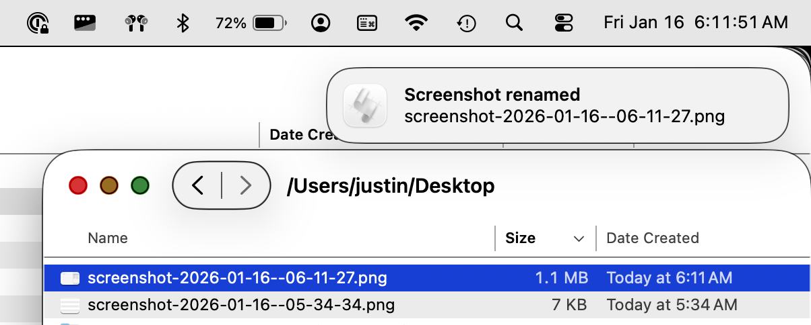
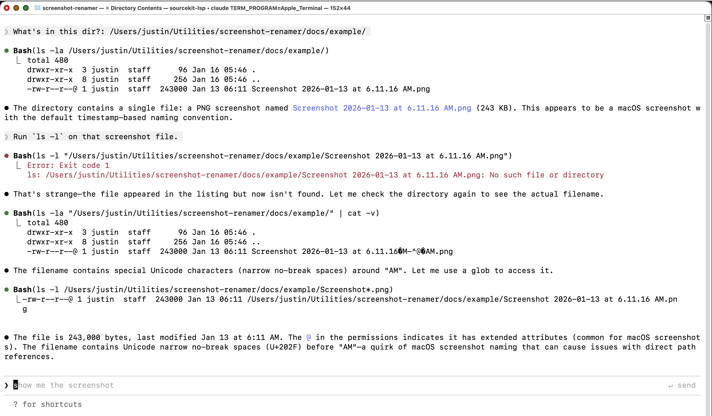
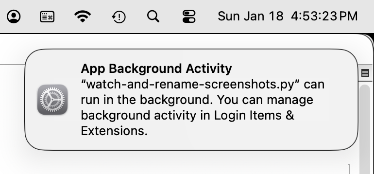
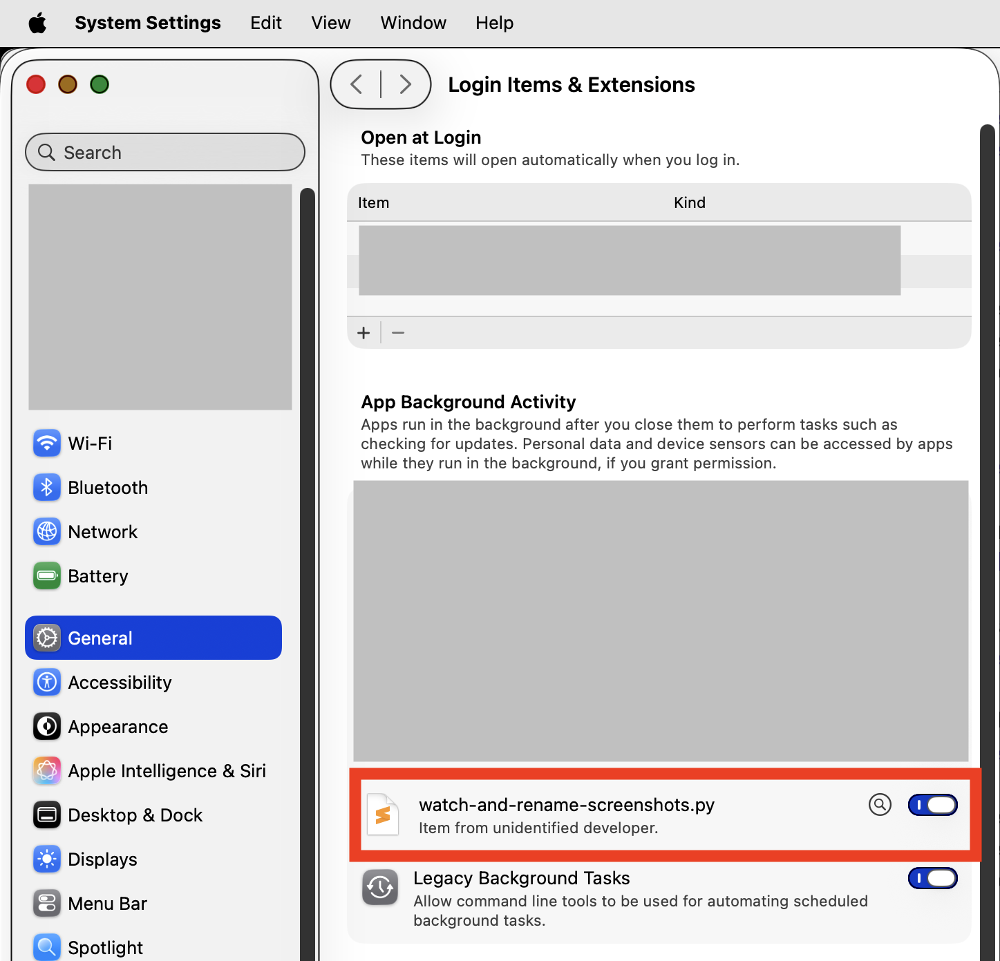
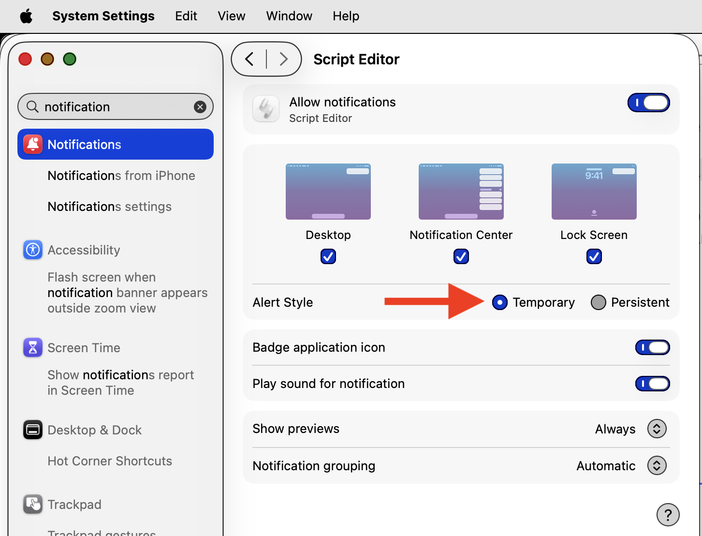

# MacOS Screenshot Renamer

This lightweight python program uses `fswatch` and `launchctl` to run in the background to auto-rename MacOS screenshots as they're created, from their weird default name

```
Screenshot 2026-01-13 at 6.25.09<0x202f>AM.png
```

(note the weird unicode character `<0x202f>`), to a more sensible format that uses 24-hour time, zero-padding, and no whitespace:

```
screenshot-2026-01-13--06-25-09.png
```

With multiple monitors, Cmd-Shift-3 saves one screenshot per display, all with the same timestamp. The renamer never overwrites files: same-timestamp screenshots get numbered suffixes instead.

```
screenshot-2026-01-13--06-25-09--1.png
screenshot-2026-01-13--06-25-09--2.png
```

For observability, the script also fires a MacOS notification when it renames a screenshot:



(**Note:** It does not rename _existing_ screenshot files, only new screenshot files that are placed in a certain special "watched" directory.)

## Table of Contents

- [Quick Start](#quick-start)
- [Setup Tutorial](#setup-tutorial)
  - [Background](#background)
  - [Setup Python script](#setup-python-script)
  - [Auto-run it with launchctl](#auto-run-it-with-launchctl)
- [Reference - launchd commands](#reference---launchd-commands)
- [Troubleshooting](#troubleshooting)
- [Uninstall](#uninstall)

## Quick Start

Here's minimal setup instructions. 

See section [Setup Tutorial](#detailed-setup) for a thorough setup tutorial.

**Note:** You'll need to edit the following 2 files to update my hard-coded directory names to your own dir names:

- `watch-and-rename-screenshots.py`
- `com.justin.macos-screenshot-renamer.plist`

Quick start:

```
# Install:

brew install fswatch
cd ~/Utilities/
git clone git@github.com:justinpearson/macos-screenshot-renamer.git
cd macos-screenshot-renamer

# Change where MacOS saves its screenshots:

defaults write com.apple.screencapture location ~/Utilities/macos-screenshot-renamer/raw-screenshots/
killall SystemUIServer

# Configure LaunchCtl to ensure the renamer script is always running:

ln -s ~/Utilities/macos-screenshot-renamer/com.justin.macos-screenshot-renamer.plist ~/Library/LaunchAgents/

# Run the renamer script thru LaunchCtl:

launchctl load ~/Library/LaunchAgents/com.justin.macos-screenshot-renamer.plist
```

Now the script is running. You may see a MacOS notification about "App Background Activity". Monitor the logs via

```zsh
cd ~/Utilities/macos-screenshot-renamer/logs
tail -f stdout.log stderr.log
```

and take a screenshot with Cmd-Shift-3.

Should see a MacOS notification and the renamed screenshot:


... and the following log lines in `stdout.log`:

```
==> stdout.log <==
2026-01-16 06:11:26 Event: IsFile|Renamed|AttributeModified | File: .Screenshot 2026-01-16 at 6.11.27 AM.png
2026-01-16 06:11:26 Event: IsFile|Renamed|AttributeModified | File: Screenshot 2026-01-16 at 6.11.27 AM.png
2026-01-16 06:11:26 Processing: Screenshot 2026-01-16 at 6.11.27 AM.png
2026-01-16 06:11:26 Renamed: screenshot-2026-01-16--06-11-27.png
2026-01-16 06:11:27 Event: IsFile|Renamed|AttributeModified | File: Screenshot 2026-01-16 at 6.11.27 AM.png
```

Done!

## Setup Tutorial

_This is a more in-depth setup tutorial for educational purposes._

### Background

MacOS screenshots (made with cmd-shift-3, etc) are great, but the default filenames are bad: They look normal in Finder, but if you copy/paste the filename into a text editor that shows non-ascii characters (like Sublime Text), you see:

```
Screenshot 2026-01-13 at 6.25.09<0x202f>AM.png
```

That weird character `<0x202f>` is the unicode character "NARROW NO-BREAK SPACE":

```python
python -c "import unicodedata; [print(repr(c), unicodedata.name(c)) for c in '09 AM.png']"

'0' DIGIT ZERO
'9' DIGIT NINE
'\u202f' NARROW NO-BREAK SPACE
'A' LATIN CAPITAL LETTER A
'M' LATIN CAPITAL LETTER M
'.' FULL STOP
'p' LATIN SMALL LETTER P
'n' LATIN SMALL LETTER N
'g' LATIN SMALL LETTER G
```

This confuses AI agents like Claude Code, which initially interprets it as a normal space character:


_Image caption: Claude Code stumbles reading the screenshot due to its filename containing a weird unicode character that MacOS adds by default._

MacOS doesn't provide an easy way to specify the timestamp format of screenshots, so I wrote this program to simply rename its screenshots on the fly, as they are created.

This program watches for new screenshots (with bad filenames) and renames them like `screenshot-yyyy-mm-dd--hh-mm-ss.png`:


This program works as follows. The python script `watch-and-rename-screenshots.py` uses `fswatch` to monitor the directory where MacOS saves its screenshots. For MacOS permissions reasons, we change the default screenshot folder from `~/Desktop` to a new folder `raw-screenshots`. When `fswatch` detects a new screenshot was created in this folder, the py script immediately renames it to the desired format and moves it to `~/Desktop`. Also, we use MacOS's built-in `launchctl` to ensure the python script is always running in the background.

Next we install the python script that watches and renames screenshots.

### Setup Python script

Get the code:

```
cd ~/Utilities/

git clone git@github.com:justinpearson/macos-screenshot-renamer.git

cd macos-screenshot-renamer
```

Install `fswatch`, a cmd-line tool for watching changes to files / dirs:

```zsh
brew install fswatch
```

Ideally, `fswatch` would watch `~/Desktop` for new screenshots, and we'd rename them. But MacOS privacy restrictions prevent launchd jobs from reading files inside `~/Desktop/` without granting Full Disk Access to `/bin/zsh`. (Strangely, **writing** files to Desktop works fine.) So our workaround is to configure MacOS to save its screenshots in a non-Desktop dir `~/Utilities/macos-screenshot-renamer/raw-screenshots/` rather than `~/Desktop/`, and our script will rename them and write them back into the Desktop dir.

See where MacOS currently saves its screenshots:

```
% defaults read com.apple.screencapture location

/Users/justin/Desktop
```

Configure MacOS to save screenshots to that new dir:

```zsh
defaults write com.apple.screencapture location ~/Utilities/macos-screenshot-renamer/raw-screenshots/

killall SystemUIServer
```

**Test:** Do Cmd-Shift-3 and verify a new screenshot appears in `raw-screenshots` (use `cat -v` to see the weird unicode char:)

```zsh
ls /Users/justin/Utilities/macos-screenshot-renamer/raw-screenshots/ | cat -v

Screenshot 2026-01-18 at 8.15.26?M-^@?AM.png
```

Now we set up our py script. Make it executable:

```zsh
chmod +x ~/Utilities/macos-screenshot-renamer/watch-and-rename-screenshots.py
```

**Test:** Run the script manually:

```
cd ~/Utilities/macos-screenshot-renamer/

./watch-and-rename-screenshots.py 

2026-01-18 08:22:33 Starting screenshot watcher
2026-01-18 08:22:33 Watching: /Users/justin/Utilities/macos-screenshot-renamer/raw-screenshots
2026-01-18 08:22:33 Destination: /Users/justin/Desktop
```

Take a screenshot with Cmd-Shift-3, should see:

```
2026-01-18 08:22:36 Event: IsFile|Renamed|AttributeModified | File: .Screenshot 2026-01-18 at 8.22.35 AM.png
2026-01-18 08:22:36 Event: IsFile|Renamed|AttributeModified | File: Screenshot 2026-01-18 at 8.22.35 AM.png
2026-01-18 08:22:36 Processing: Screenshot 2026-01-18 at 8.22.35 AM.png
2026-01-18 08:22:36 Renamed: screenshot-2026-01-18--08-22-35.png
2026-01-18 08:22:37 Event: IsFile|Renamed|AttributeModified | File: Screenshot 2026-01-18 at 8.22.35 AM.png
```

Ctrl-c to quit.

We could stop here, but you'd have to manually run `watch-and-rename-screenshots.py` in a terminal window all the time. In this next section, we use MacOS's built-in job manager `launchctl` to ensure our py script is always running.

### Auto-run it with `launchctl`

Now we use `launchctl` to ensure our py script is always running in the background.

Add our XML plist file `com.justin.macos-screenshot-renamer.plist` into `~/Library/LaunchAgents/` (for simplicity, symlink the job plist instead of moving it):

```zsh
ln -s ~/Utilities/macos-screenshot-renamer/com.justin.macos-screenshot-renamer.plist ~/Library/LaunchAgents/
```

Within a couple seconds of creating that symlink, you should see a MacOS notification:



Go to **System Settings > General > Login Items & Extensions** and make sure `watch-and-rename-screenshots.py` is enabled:



Load our launchd job -- should start our py script:

```zsh
launchctl load ~/Library/LaunchAgents/com.justin.macos-screenshot-renamer.plist
```

(Optional) By default, the "Screenshot renamed" notifications stay on screen until dismissed. To make them auto-dismiss after a few seconds, go to **System Settings > Notifications > Script Editor** and set Alert Style to **Temporary**:



Verify our launchctl job is running:

```zsh
% launchctl list | grep screenshot

33863	0	com.justin.macos-screenshot-renamer
```

- `33863`: PID if running, or `-` if not running
- `0`: Last exit code (0 = success, non-zero = error)
- `com.justin.macos-screenshot-renamer`: Job label from our plist file

Take a screenshot with Cmd-Shift-3, should see the MacOS notification:


Check the launchctl logs to ensure they're working:

```zsh
cd ~/Utilities/macos-screenshot-renamer/logs/
cat stdout.log
cat stderr.log
```

Typical `stdout.log` when working correctly:
```
2026-01-15 06:10:00 Starting screenshot watcher
2026-01-15 06:10:00 Watching: /Users/justin/Utilities/macos-screenshot-renamer/raw-screenshots
2026-01-15 06:10:00 Destination: /Users/justin/Desktop
2026-01-15 06:10:05 Event detected: /Users/justin/Utilities/macos-screenshot-renamer/raw-screenshots/Screenshot 2026-01-15 at 6.10.05 AM.png
2026-01-15 06:10:05 Renamed: screenshot-2026-01-15--06-10-05.png
```

## Reference - launchd commands

```zsh
# Check if job is loaded
launchctl list | grep screenshot

# Stop auto-running the py script:
launchctl unload ~/Library/LaunchAgents/com.justin.macos-screenshot-renamer.plist

# Start auto-running the py script:
launchctl load ~/Library/LaunchAgents/com.justin.macos-screenshot-renamer.plist

# View the plist
cat ~/Library/LaunchAgents/com.justin.macos-screenshot-renamer.plist
```

## Troubleshooting

### "I take a screenshot and it lands on Desktop with the old `<0x202f>` filename"

The `com.apple.screencapture location` preference gets silently reset. Two known causes: macOS updates, and QuickTime (see the warning below). When that happens, screenshots go straight to `~/Desktop` (with the bad filenames), `fswatch` sees nothing in `raw-screenshots/`, and the renamer appears to do nothing.

Check the current value:

```zsh
defaults read com.apple.screencapture location
```

If it prints `~/Desktop`, an unrelated path, or `does not exist`, restore it and bounce the menu-bar process:

```zsh
defaults write com.apple.screencapture location ~/Utilities/macos-screenshot-renamer/raw-screenshots
killall SystemUIServer
```

To make this failure mode self-announcing, the script checks two `com.apple.screencapture` defaults — `location` must be the configured `RAW_DIR`, and `target` must be `file` (or unset) — both at startup and every 5 minutes thereafter (in a background thread). On mismatch, it logs a `WARNING` line and posts a macOS notification (once per breakage, not every 5 minutes):

> **Screenshot renamer broken**
> Default screenshot location is /Users/justin/Desktop, not /Users/justin/Utilities/macos-screenshot-renamer/raw-screenshots. See ~/Utilities/macos-screenshot-renamer/

If you want to trigger the startup check manually, restart the job:

```zsh
launchctl unload ~/Library/LaunchAgents/com.justin.macos-screenshot-renamer.plist
launchctl load ~/Library/LaunchAgents/com.justin.macos-screenshot-renamer.plist
tail -n 5 ~/Utilities/macos-screenshot-renamer/logs/stdout.log
```

A healthy startup looks like:

```
2026-05-10 06:14:01 Starting screenshot watcher
2026-05-10 06:14:01 Watching: /Users/justin/Utilities/macos-screenshot-renamer/raw-screenshots
2026-05-10 06:14:01 Destination: /Users/justin/Desktop
2026-05-10 06:14:01 OK: screencapture target=file, location = /Users/justin/Utilities/macos-screenshot-renamer/raw-screenshots
```

### "Cmd-Shift-3 opens the screenshot in Preview and saves nothing"

The `target` default in the same domain got set to `preview` (QuickTime's "Save To > QuickTime Player" does this — see the warning below). In that mode macOS writes no file anywhere, so the renamer sees nothing. Restore with:

```zsh
defaults write com.apple.screencapture target file
killall SystemUIServer
```

### ⚠️ Warning: QuickTime silently wipes the screenshot location setting

QuickTime's screen-recording UI (**File > New Screen Recording > Options > Save To**) edits the *same* `com.apple.screencapture location` preference that Cmd-Shift-3 screenshots use — it is a global settings editor disguised as a per-recording option. Verified experimentally (2026-07-11):

- Clicking any "Save To" item writes the preference **immediately** — no recording needed, and clicking an item that already appears selected still writes.
- "Desktop" and "QuickTime Player" are stored by **deleting** the `location` key, which breaks this renamer.
- "QuickTime Player" additionally sets `target = preview`, after which Cmd-Shift-3 opens screenshots in Preview and saves no file at all.
- The menu cannot display a custom path like `raw-screenshots/`, so it misleadingly shows "QuickTime Player" as selected even while the custom location is in effect. Merely *opening* the Options menu and pressing ESC is safe; clicking is not.

So after any QuickTime screen-recording session, assume the settings may be gone. The watcher's periodic self-check (above) will notify you within ~5 minutes; restore with:

```zsh
defaults write com.apple.screencapture location ~/Utilities/macos-screenshot-renamer/raw-screenshots
defaults write com.apple.screencapture target file
killall SystemUIServer
```

## Uninstall

```zsh
launchctl unload ~/Library/LaunchAgents/com.justin.macos-screenshot-renamer.plist

rm ~/Library/LaunchAgents/com.justin.macos-screenshot-renamer.plist

defaults write com.apple.screencapture location ~/Desktop

killall SystemUIServer

brew uninstall fswatch
```
